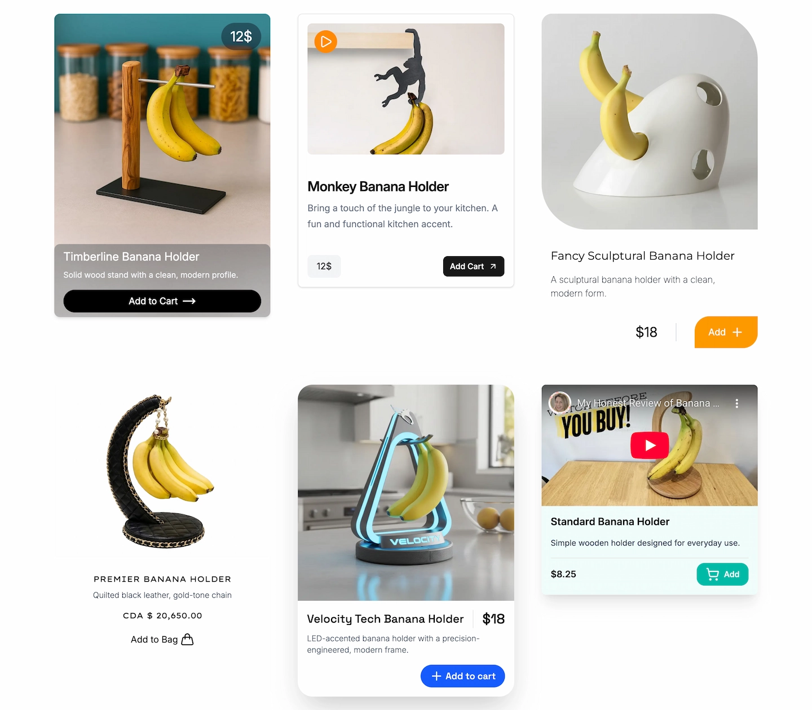

# E-commerce Product Cards

This project is a collection of product card components built with
React and Tailwind CSS. It was created as part of coursework in the BCIT.


## Overview 
This project focuses on visually polished product cards with a strong
emphasis on user experience, while maintaining semantic HTML and
accessibility best practices. Each card features a unique design (including image, title, description, icon) and
interaction pattern. 

## Tech Stack
- React
- Tailwind CSS
- Lucide Icons
- Shadcn
- TypeScript
- Vite

## Key Features
- Semantic HTML structure using `article`, `figure`, and `footer`
- Accessible images with descriptive `alt` text and `figcaption`
- Interactive UI elements with hover and click feedback
- Reusable card components with consistent layout patterns
- Embedded audio playback within product cards
- Optimized YouTube video embedding using `react-youtube`
- Google Fonts selection tailored to individual card designs
- Toast notifications implemented with shadcn/ui components
## Challenges
> I spent time researching card UI design and creating layouts in Figma.
> Some card designs were inspired by Chanel’s website, which helped me
> understand the tone and visual language of luxury brand UI design.

> Tailwind CSS v4 introduced many new features, and experimenting with
> hover animations and custom styling within `index.css` provided
> valuable hands-on practice.

> Through implementing audio playback in React, I gained a deeper
> understanding of DOM manipulation and the importance of `useRef`.

## How to Run
```bash
pnpm install
pnpm run dev
```

## Live Demo
🚀 [View Live Site](https://ui-cards-mashup-challenge-juxt.vercel.app/)